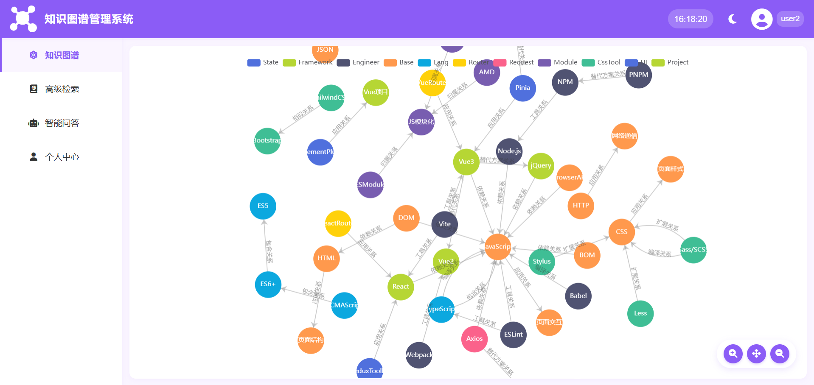
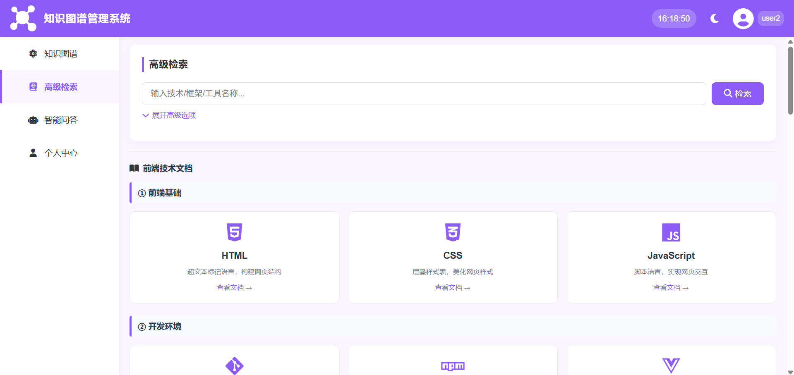
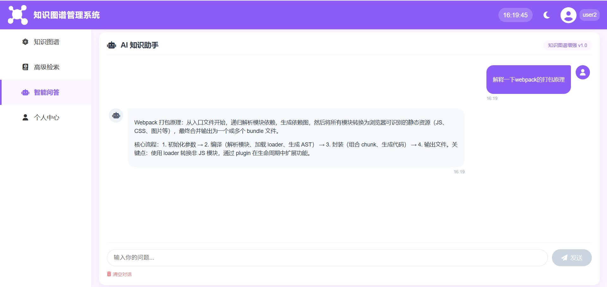
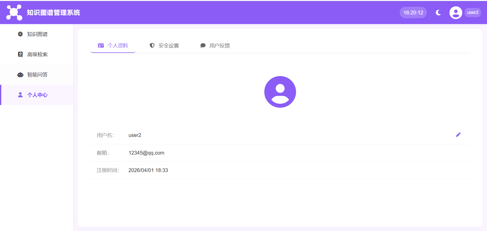
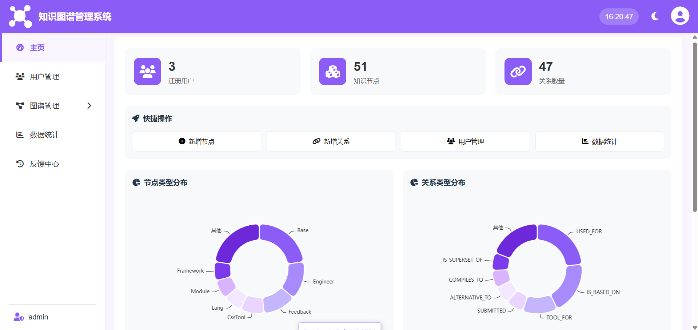
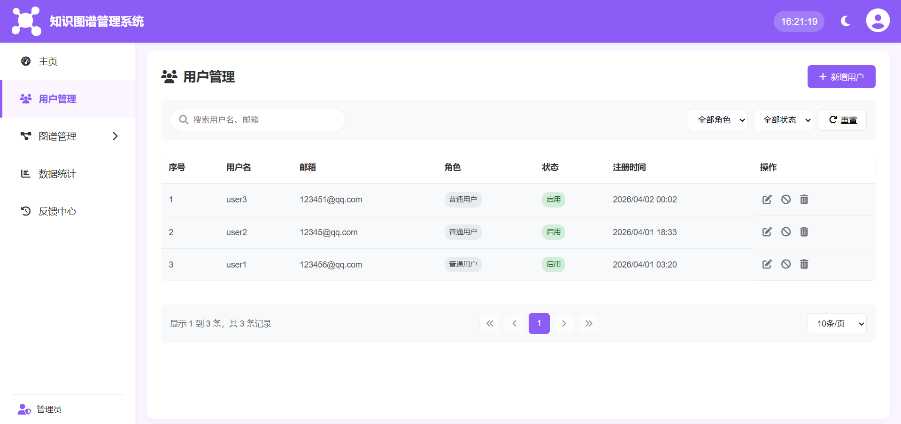
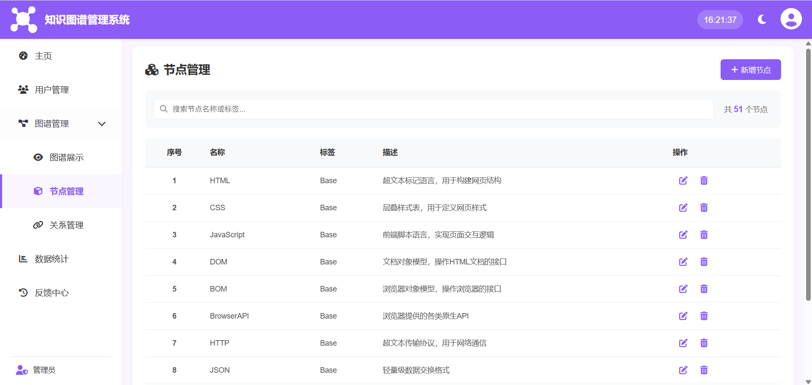
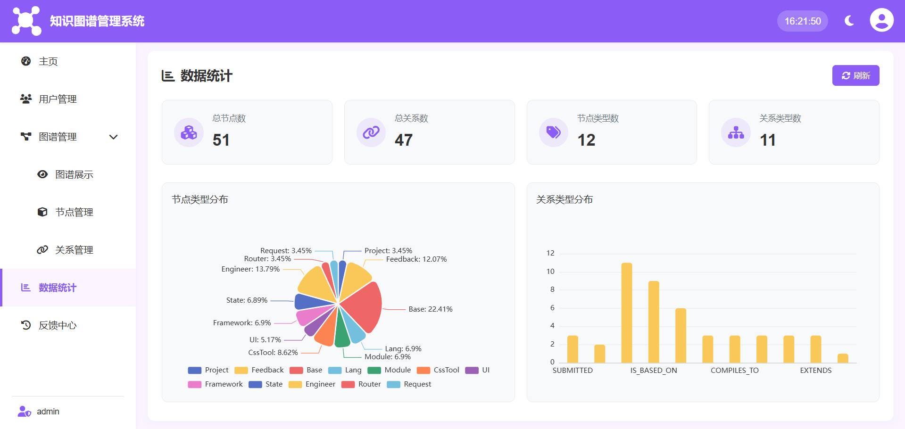
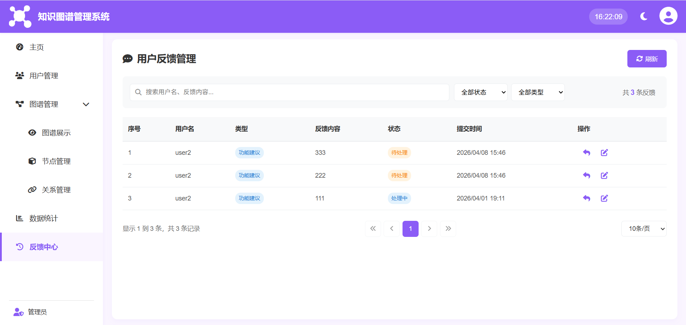

# 面向前端开发者的知识图谱

本地部署

本研究主要针对前端技术迭代所引发的知识碎片化以及开发者缺乏系统性工具的问题，旨在设计并实现一个面向前端开发者的知识图谱系统。该系统将分散的技术资料进行整合，构建结构清晰的知识网络，为用户提供可视化的知识检索以及系统化学习导航服务。

本系统采用前后端分离架构。后端基于Node.js与Express构建RESTful API，使用Neo4j存储知识节点和关系，并通过JWT实现身份验证。前端采用Vue.js和ECharts来实现图谱的可视化与交互操作。本系统主要分为普通用户与管理员两大模块，包含11个核心功能模块，具体为登录注册、图谱可视化、智能问答、检索查询、知识点详情、个人中心、节点管理、关系管理、用户管理、数据统计及用户反馈。

经过功能与性能测试，系统各模块运行稳定，满足设计需求。在性能上，图谱初始渲染耗时小于2s，拖拽缩放帧率大于50fps。在50个用户同时在线的情况下，主要接口的响应时间小于2s，关键词检索接口响应时间为小于500ms，可满足用户流畅交互需求。该系统可为开发者提供学习与选型参考，为前端知识体系化提供了可视化工具，验证了轻量级技术栈构建图谱系统的可行性。

普通用户

后台管理员用户

